# 神经网络的介绍

## 目标

1. 知道神经网络的概念
2. 知道什么是神经元
3. 知道什么是单层神经网络
4. 知道什么是感知机
5. 知道什么是多层神经网络
6. 知道激活函数是什么，有什么作用
7. 理解神经网络的思想

## 1. 人工神经网络的概念

**人工神经网络**（英语：Artificial Neural Network，ANN），简称**神经网络**（Neural Network，NN）或**类神经网络**，是一种模仿生物神经网络（动物的中枢神经系统，特别是大脑）的结构和功能的数学模型，用于对函数进行估计或近似。

和其他机器学习方法一样，神经网络已经被用于解决各种各样的问题，例如机器视觉和语音识别。这些问题都是很难被传统基于规则的编程所解决的。

## 2. 神经元的概念

在生物神经网络中，每个神经元与其他神经元相连，当它“兴奋”时，就会向相连的神经元发送化学物质，从而改变这些神经元内的电位；如果某神经元的电位超过了一个“阈值”，那么它就会被激活，即“兴奋”起来，向其他神经元发送化学物质。

1943 年，McCulloch 和 Pitts 将上述情形抽象为上图所示的简单模型，这就是一直沿用至今的 **M-P 神经元模型**。把许多这样的神经元按一定的层次结构连接起来，就得到了神经网络。

一个简单的神经元如下图所示，

其中：

1. $a_1,a_2\dots a_n$ 为各个输入的分量
2. $w_1,w_2 \cdots w_n$ 为各个输入分量对应的权重参数
3. $b$ 为偏置
4. $f$ 为**激活函数**，常见的激活函数有tanh，sigmoid，relu
5. $t​$ 为神经元的输出

使用数学公式表示就是：
$$
t = f(W^TA+b)
$$
可见，**一个神经元的功能是求得输入向量与权向量的内积后，经一个非线性传递函数得到一个标量结果**。

## 3. 单层神经网络

是最基本的神经元网络形式，由有限个神经元构成，所有神经元的输入向量都是同一个向量。由于每一个神经元都会产生一个标量结果，所以单层神经元的输出是一个向量，向量的维数等于神经元的数目。

示意图如下：

## 4. 感知机

感知机由**两层神经网**络组成，**输入层**接收外界输入信号后传递给**输出层（输出+1正例，-1反例）**，输出层是 M-P 神经元

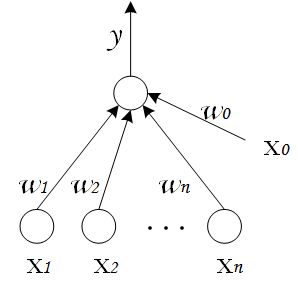

其中从$w_0,w_1\cdots w_n$都表示权重

**感知机的作用：**

把一个n维向量空间用一个超平面分割成两部分，给定一个输入向量，超平面可以判断出这个向量位于超平面的哪一边，得到输入时正类或者是反类，**对应到2维空间就是一条直线把一个平面分为两个部分**。

## 5. 多层神经网络

多层神经网络就是由单层神经网络进行叠加之后得到的，所以就形成了**层**的概念，常见的多层神经网络有如下结构：

- 输入层（Input layer），众多神经元（Neuron）接受大量非线形输入消息。输入的消息称为输入向量。
- 输出层（Output layer），消息在神经元链接中传输、分析、权衡，形成输出结果。输出的消息称为输出向量。
- 隐藏层（Hidden layer），简称“隐层”，是输入层和输出层之间众多神经元和链接组成的各个层面。隐层可以有一层或多层。隐层的节点（神经元）数目不定，但数目越多神经网络的非线性越显著，从而神经网络的强健性（robustness）更显著。

示意图如下：

**概念：全连接层**

全连接层：当前一层和前一层每个神经元相互链接，我们称当前这一层为全连接层。

思考：假设第N-1层有m个神经元，第N层有n个神经元，当第N层是全连接层的时候，则N-1和N层之间有多少个参数w，这些参数可以如何表示？

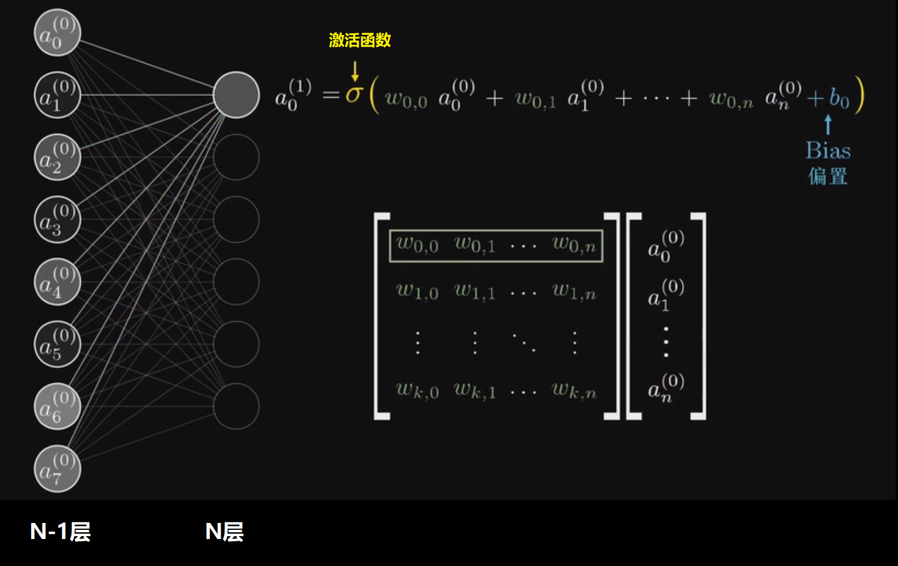

从上图可以看出，所谓的全连接层就是在前一层的输出的基础上进行一次$Y=Wx+b$的变化(不考虑激活函数的情况下就是一次线性变化，所谓线性变化就是平移(+b)和缩放的组合(*w))

## 6. 激活函数

在前面的神经元的介绍过程中我们提到了激活函数，那么他到底是干什么的呢？

假设我们有这样一组数据，三角形和四边形，需要把他们分为两类

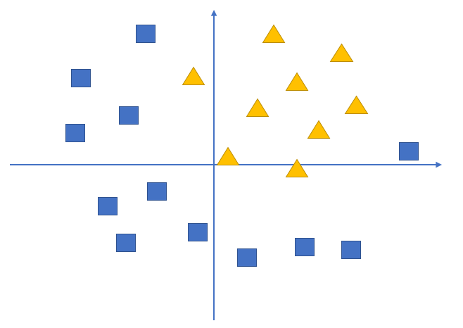

通过感知机模型我们可以划出一条线, 把平面分割开

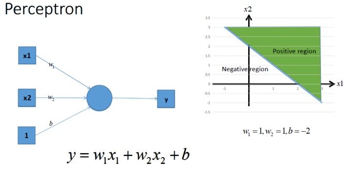

假设我们确定了参数w和b之后，那么带入需要预测的数据，如果y>0,我们认为这个点在直线的右边，也就是正类（三角形），否则是在左边（四边形）

但是可以看出，三角形和四边形是没有办法通过直线分开的，那么这个时候该怎么办？

可以考虑使用多层神经网络来进行尝试，比如**在前面的感知机模型中再增加一层**

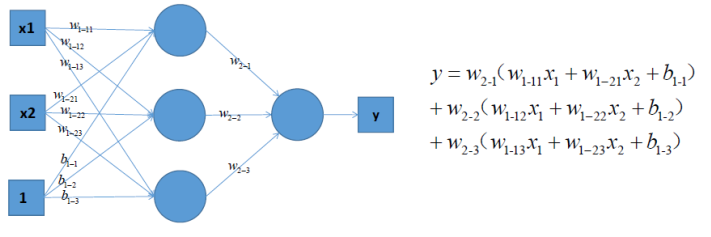

对上图中的等式进行合并，我们可以得到：
$$
y = (w_{1-11}w_{2-1}+\cdots)x_1+(w_{1-21}w_{2-1}+\cdots)x_2 + (w_{2-1}+\cdots)b_{1-1}
$$
上式括号中的都为w参数，和公式$y = w_1x_1 + w_2x_2 +b$完全相同，依然只能够绘制出直线

所以可以发现，即使是多层神经网络，相比于前面的感知机，没有任何的改进。

但是如果此时，我们在前面感知机的基础上加上**非线性的激活函数**之后，输出的结果就不在是一条直线

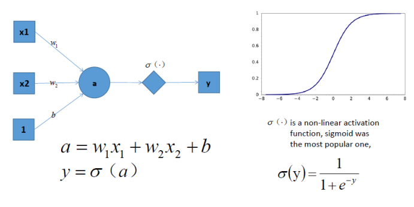

如上图，右边是sigmoid函数，对感知机的结果，通过sigmoid函数进行处理

如果给定合适的参数w和b，就可以得到合适的曲线，能够完成对最开始问题的非线性分割

所以激活函数很重要的一个**作用**就是**增加模型的非线性分割能力**

常见的激活函数有：

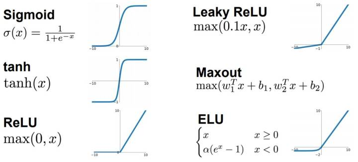

看图可知：

- sigmoid 只会输出正数，以及靠近0的输出变化率最大
- tanh和sigmoid不同的是，tanh输出可以是负数
- Relu是输入只能大于0,如果你输入含有负数，Relu就不适合，如果你的输入是图片格式，Relu就挺常用的，因为图片的像素值作为输入时取值为[0,255]。

激活函数的作用除了前面说的**增加模型的非线性分割能力**外，还有

- **提高模型鲁棒性**
- **缓解梯度消失问题**
- **加速模型收敛等**

这些好处，大家后续会慢慢体会到，这里先知道就行

## 6. 神经网络示例

一个男孩想要找一个女朋友，于是实现了一个**女友判定机**，随着年龄的增长，他的判定机也一直在变化

14岁的时候：

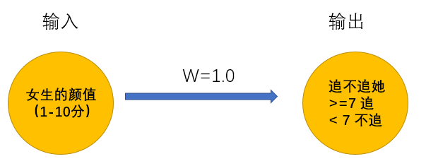

无数次碰壁之后，男孩意识到追到女孩的可能性和颜值一样重要，于是修改了判定机：

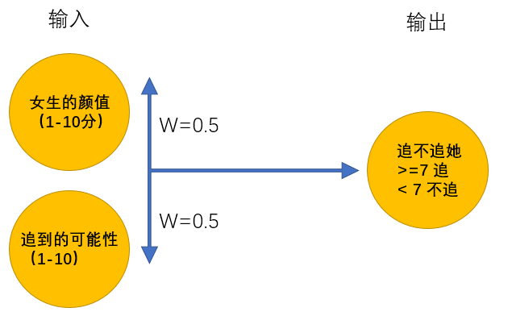

在15岁的时候终于找到呢女朋友，但是一顿时间后他发现有各种难以忍受的习惯，最终决定分手。一段空窗期中，他发现找女朋友很复杂，需要更多的条件才能够帮助他找到女朋友，于是在25岁的时候，他再次修改了判定机：

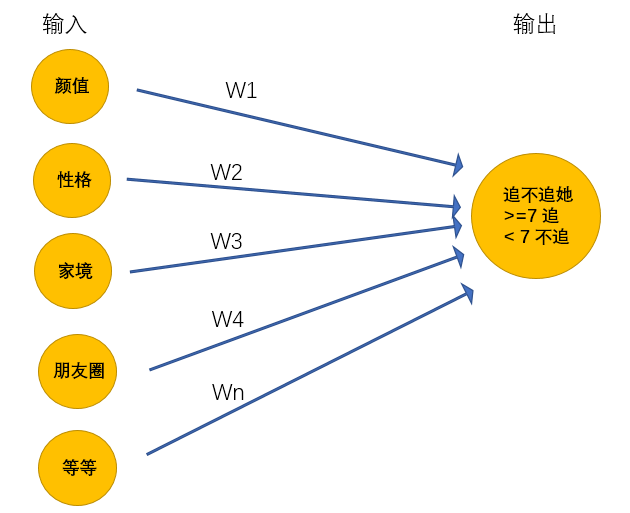

在更新了女友判定机之后，问题又来了，很多指标不能够很好的量化，如何颜值，什么样的叫做颜值高，什么样的叫做性格好等等，为了解决这个问题，他又更新了判定机，最终得到**超级女友判定机**

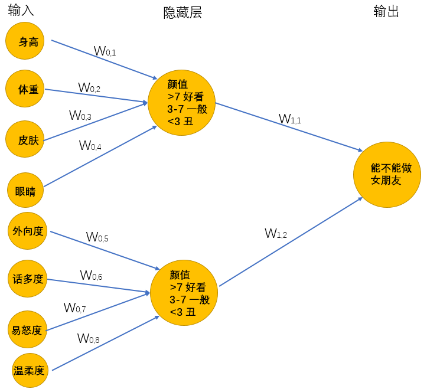

上述的超级女友判定机其实就是神经网络，它能够接受基础的输入，通过隐藏层的线性的和非线性的变化最终的到输出

通过上面例子，希望大家能够理解深度学习的**思想**：

输出的最原始、最基本的数据，通过模型来进行特征工程，进行更加高级特征的学习，然后通过传入的数据来确定合适的参数，让模型去更好的拟合数据。

这个过程可以理解为盲人摸象，多个人一起摸，把摸到的结果乘上合适的权重，进行合适的变化，让他和目标值趋近一致。整个过程只需要输入基础的数据，程序自动寻找合适的参数。