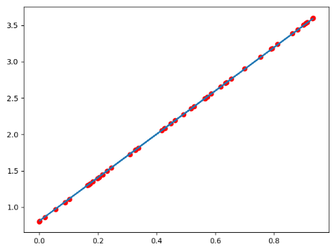
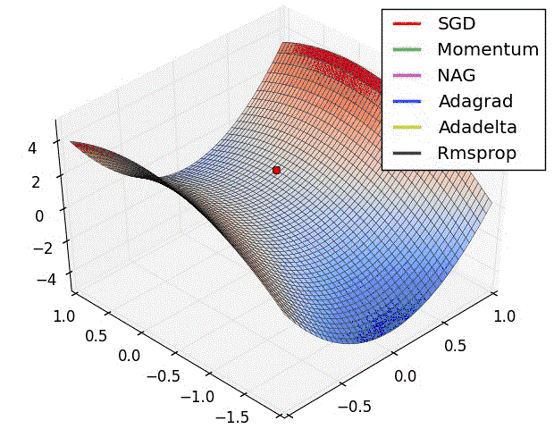

# Pytorch完成基础的模型

## 目标

1. 知道Pytorch中Module的使用方法
2. 知道Pytorch中优化器类的使用方法
3. 知道Pytorch中常见的损失函数的使用方法
4. 知道如何在GPU上运行代码
5. 能够说出常见的优化器及其原理


## 1. Pytorch完成模型常用API

在前一部分，我们自己实现了通过torch的相关方法完成反向传播和参数更新，在pytorch中预设了一些更加灵活简单的对象，让我们来构造模型、定义损失，优化损失等

那么接下来，我们一起来了解一下其中常用的API


### 1.1 `nn.Module`

`nn.Modul` 是`torch.nn`提供的一个类，是pytorch中我们`自定义网络`的一个基类，在这个类中定义了很多有用的方法，让我们在继承这个类定义网络的时候非常简单

当我们自定义网络的时候，有两个方法需要特别注意：

1. `__init__`需要调用`super`方法，继承父类的属性和方法
2. `farward`方法必须实现，用来定义我们的网络的向前计算的过程

用前面的`y = wx+b`的模型举例如下：

```python
from torch import nn
class Lr(nn.Module):
    def __init__(self):
        super(Lr, self).__init__()  #继承父类init的参数
        self.linear = nn.Linear(1, 1) 

    def forward(self, x):
        out = self.linear(x)
        return out
```

注意：

1. `nn.Linear`为torch预定义好的线性模型，也被称为**全链接层**，传入的参数为输入的数量，输出的数量(in_features, out_features),是不算(batch_size的列数)
2. `nn.Module`定义了`__call__`方法，实现的就是调用`forward`方法，即`Lr`的实例，能够直接被传入参数调用，实际上调用的是`forward`方法并传入参数

```python
# 实例化模型
model = Lr()
# 传入数据，计算结果
predict = model(x)
```

### 1.2 优化器类

优化器(`optimizer`)，可以理解为torch为我们封装的用来进行更新参数的方法，比如常见的随机梯度下降(`stochastic gradient descent,SGD`)

优化器类都是由`torch.optim`提供的，例如

1. `torch.optim.SGD(参数，学习率)`
2. `torch.optim.Adam(参数，学习率)`

注意：

1. 参数可以使用`model.parameters()`来获取，获取模型中所有`requires_grad=True`的参数
2. 优化类的使用方法
   1. 实例化
   2. 所有参数的梯度，将其值置为0
   3. 反向传播计算梯度
   4. 更新参数值

示例如下：

```python
optimizer = optim.SGD(model.parameters(), lr=1e-3) #1. 实例化
optimizer.zero_grad() #2. 梯度置为0
loss.backward() #3. 计算梯度
optimizer.step()  #4. 更新参数的值
```


### 1.3 损失函数

前面的例子是一个回归问题，torch中也预测了很多损失函数

1. 均方误差:`nn.MSELoss()`,常用语分类问题
2. 交叉熵损失：`nn.CrossEntropyLoss()`，常用语逻辑回归

使用方法：

```python
model = Lr() #1. 实例化模型
criterion = nn.MSELoss() #2. 实例化损失函数
optimizer = optim.SGD(model.parameters(), lr=1e-3) #3. 实例化优化器类
for i in range(100):
    y_predict = model(x_true) #4. 向前计算预测值
    loss = criterion(y_true,y_predict) #5. 调用损失函数传入真实值和预测值，得到损失结果
    optimizer.zero_grad() #5. 当前循环参数梯度置为0
    loss.backward() #6. 计算梯度
    optimizer.step()  #7. 更新参数的值
```

### 1.4 把线性回归完整代码

```python
import torch
from torch import nn
from torch import optim
import numpy as np
from matplotlib import pyplot as plt

# 1. 定义数据
x = torch.rand([50,1])
y = x*3 + 0.8

#2 .定义模型
class Lr(nn.Module):
    def __init__(self):
        super(Lr,self).__init__()
        self.linear = nn.Linear(1,1)
		
    def forward(self, x):
        out = self.linear(x)
        return out

# 2. 实例化模型，loss，和优化器
model = Lr()
criterion = nn.MSELoss()
optimizer = optim.SGD(model.parameters(), lr=1e-3)
#3. 训练模型
for i in range(30000):
    out = model(x) #3.1 获取预测值
    loss = criterion(y,out) #3.2 计算损失
    optimizer.zero_grad()  #3.3 梯度归零
    loss.backward() #3.4 计算梯度
    optimizer.step()  # 3.5 更新梯度
    if (i+1) % 20 == 0:
        print('Epoch[{}/{}], loss: {:.6f}'.format(i,30000,loss.data))

#4. 模型评估
model.eval() #设置模型为评估模式，即预测模式
predict = model(x)
predict = predict.data.numpy()
plt.scatter(x.data.numpy(),y.data.numpy(),c="r")
plt.plot(x.data.numpy(),predict)
plt.show()
```

输出如下：



注意：

`model.eval()`表示设置模型为评估模式，即预测模式

`model.train(mode=True)` 表示设置模型为训练模式

在当前的线性回归中，上述并无区别

但是在其他的一些模型中，**训练的参数和预测的参数会不相同**，到时候就需要具体告诉程序我们是在进行训练还是预测，比如模型中存在**Dropout**，**BatchNorm**的时候

## 2. 在GPU上运行代码

当模型太大，或者参数太多的情况下，为了加快训练速度，经常会使用GPU来进行训练

此时我们的代码需要稍作调整：

1. 判断GPU是否可用`torch.cuda.is_available()`

   ```python
   torch.device("cuda:0" if torch.cuda.is_available() else "cpu")
   >>device(type='cuda', index=0)  #使用gpu
   >>device(type='cpu') #使用cpu
   ```

   

2. 把模型参数和input数据转化为cuda的支持类型

   ```python
   model.to(device)
   x_true.to(device)
   ```

  

3. 在GPU上计算结果也为cuda的数据类型，需要转化为numpy或者torch的cpu的tensor类型

   ```python
   predict = predict.cpu().detach().numpy() 
   ```

   `detach()`的效果和data的相似，但是`detach()`是深拷贝，data是取值，是浅拷贝


修改之后的代码如下：

```python
import torch
from torch import nn
from torch import optim
import numpy as np
from matplotlib import pyplot as plt
import time

# 1. 定义数据
x = torch.rand([50,1])
y = x*3 + 0.8

#2 .定义模型
class Lr(nn.Module):
    def __init__(self):
        super(Lr,self).__init__()
        self.linear = nn.Linear(1,1)

    def forward(self, x):
        out = self.linear(x)
        return out

# 2. 实例化模型，loss，和优化器

device = torch.device("cuda:0" if torch.cuda.is_available() else "cpu")
x,y = x.to(device),y.to(device)

model = Lr().to(device)
criterion = nn.MSELoss()
optimizer = optim.SGD(model.parameters(), lr=1e-3)

#3. 训练模型
for i in range(300):
    out = model(x)
    loss = criterion(y,out)

    optimizer.zero_grad()
    loss.backward()
    optimizer.step()
    if (i+1) % 20 == 0:
        print('Epoch[{}/{}], loss: {:.6f}'.format(i,30000,loss.data))

#4. 模型评估
model.eval() #
predict = model(x)
predict = predict.cpu().detach().numpy() #转化为numpy数组
plt.scatter(x.cpu().data.numpy(),y.cpu().data.numpy(),c="r")
plt.plot(x.cpu().data.numpy(),predict,)
plt.show()

```

## 3. 常见的优化算法介绍

### 3.1 梯度下降算法（batch gradient descent BGD）

每次迭代都需要把所有样本都送入，这样的好处是每次迭代都顾及了全部的样本，做的是全局最优化,但是有可能达到局部最优。

### 3.2 随机梯度下降法 (Stochastic gradient descent SGD)

针对梯度下降算法训练速度过慢的缺点，提出了随机梯度下降算法，随机梯度下降算法算法是从样本中随机抽出一组，训练后按梯度更新一次，然后再抽取一组，再更新一次，在样本量及其大的情况下，可能不用训练完所有的样本就可以获得一个损失值在可接受范围之内的模型了。

torch中的api为：`torch.optim.SGD()`

### 3.3 小批量梯度下降 (Mini-batch gradient descent MBGD）

SGD相对来说要快很多，但是也有存在问题，由于单个样本的训练可能会带来很多噪声，使得SGD并不是每次迭代都向着整体最优化方向，因此在刚开始训练时可能收敛得很快，但是训练一段时间后就会变得很慢。在此基础上又提出了小批量梯度下降法，它是每次从样本中随机抽取一小批进行训练，而不是一组，这样即保证了效果又保证的速度。

### 3.4 动量法

mini-batch SGD算法虽然这种算法能够带来很好的训练速度，但是在到达最优点的时候并不能够总是真正到达最优点，而是在最优点附近徘徊。

另一个缺点就是mini-batch SGD需要我们挑选一个合适的学习率，当我们采用小的学习率的时候，会导致网络在训练的时候收敛太慢；当我们采用大的学习率的时候，会导致在训练过程中优化的幅度跳过函数的范围，也就是可能跳过最优点。我们所希望的仅仅是网络在优化的时候网络的损失函数有一个很好的收敛速度同时又不至于摆动幅度太大。

所以Momentum优化器刚好可以解决我们所面临的问题，它主要是基于梯度的移动指数加权平均，对网络的梯度进行平滑处理的，让梯度的摆动幅度变得更小。
$$
\begin{align*}
&gradent = 0.8\nabla w + 0.2 history\_gradent  &，\nabla w 表示当前一次的梯度\\
&w = w - \alpha* gradent &，\alpha表示学习率
\end{align*}
$$

（注：t+1的的histroy_gradent 为第t次的gradent）

### 3.5 AdaGrad 

AdaGrad算法就是将每一个参数的每一次迭代的梯度取平方累加后在开方，用全局学习率除以这个数，作为学习率的动态更新，从而达到**自适应学习率**的效果
$$
\begin{align*}
&gradent = history\_gradent + (\nabla w)^2 \\
&w = w - \frac{\alpha}{\sqrt{gradent}+\delta} \nabla w ,&\delta为小常数，为了数值稳定大约设置为10^{-7}
\end{align*}
$$

### 3.6 RMSProp

Momentum优化算法中，虽然初步解决了优化中摆动幅度大的问题,为了进一步优化损失函数在更新中存在摆动幅度过大的问题，并且进一步加快函数的收敛速度，RMSProp算法对参数的梯度使用了平方加权平均数。 
$$
\begin{align*}
& gradent = 0.8*history\_gradent + 0.2*(\nabla w)^2 \\
& w = w - \frac{\alpha}{\sqrt{gradent}+\delta} \nabla w
\end{align*}
$$

### 3.7 Adam

Adam（Adaptive Moment Estimation）算法是将Momentum算法和RMSProp算法结合起来使用的一种算法,能够达到防止梯度的摆幅多大，同时还能够加开收敛速度
$$
\begin{align*}
& 1. 需要初始化梯度的累积量和平方累积量 \\
& v_w = 0,s_w = 0 \\
& 2. 第 t 轮训练中，我们首先可以计算得到Momentum和RMSProp的参数更新：\\
& v_w = 0.8v  + 0.2 \nabla w \qquad,Momentum计算的梯度\\
& s_w = 0.8*s + 0.2*(\nabla w)^2 \qquad,RMSProp计算的梯度\\
& 3. 对其中的值进行处理后，得到：\\
& w = w - \frac{\alpha}{\sqrt{s_w}+\delta} v_w
\end{align*}
$$
torch中的api为：`torch.optim.Adam()`


### 3.8 效果演示：



​	