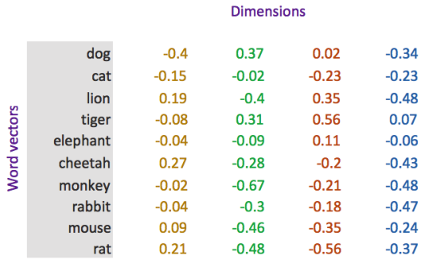

# 循环神经网络和自然语言处理介绍

## 目标

1. 知道`token`和`tokenization`
2. 知道`N-gram`的概念和作用
3. 知道文本向量化表示的方法


## 1. 文本的`tokenization`

### 1.1 概念和工具的介绍

`tokenization`就是通常所说的分词，分出的每一个词语我们把它称为`token`。

常见的分词工具很多，比如：

- `jieba分词：https://github.com/fxsjy/jieba`
- 清华大学的分词工具THULAC：`https://github.com/thunlp/THULAC-Python`

### 1.2 中英文分词的方法

- 把句子转化为词语
  - 比如：`我爱深度学习` 可以分为`[我，爱， 深度学习]`
- 把句子转化为单个字
  - 比如：`我爱深度学习`的token是`[我，爱，深，度，学，习]`


## 2. `N-garm`表示方法

前面我们说，句子可以用但个字，词来表示，但是有的时候，我们可以用2个、3个或者多个词来表示。

`N-gram`一组一组的词语，其中的`N`表示能够被一起使用的词的数量

例如：

```python
In [59]: text = "深度学习（英语：deep learning）是机器学习的分支，是一种以人工神经网络为架构，对数据进行表征学习的算法。"

In [60]: cuted = jieba.lcut(text)

In [61]: [cuted[i:i+2] for i in range(len(cuted)-1)] #N-gram 中n=2时
Out[61]:[['深度', '学习'],
 ['学习', '（'],
 ['（', '英语'],
 ['英语', '：'],
 ['：', 'deep'],
 ['deep', ' '],
 [' ', 'learning'],
 ['learning', '）'],
 ['）', '是'],
 ['是', '机器'],
 ['机器', '学习'],
 ['学习', '的'],
 ['的', '分支'],
 ['分支', '，'],
 ['，', '是'],
 ['是', '一种'],
 ['一种', '以'],
 ['以', '人工神经网络'],
 ['人工神经网络', '为'],
 ['为', '架构'],
 ['架构', '，'],
 ['，', '对'],
 ['对', '数据'],
 ['数据', '进行'],
 ['进行', '表征'],
 ['表征', '学习'],
 ['学习', '的'],
 ['的', '算法'],
 ['算法', '。']]
```

在传统的机器学习中，使用N-gram方法往往能够取得非常好的效果，但是在深度学习比如RNN中会自带N-gram的效果。


## 3. 向量化

因为文本不能够直接被模型计算，所以需要将其转化为向量

把文本转化为向量有两种方法：

1. 转化为one-hot编码
2. 转化为word embedding

### 3.1 one-hot 编码

在one-hot编码中，每一个token使用一个长度为N的向量表示，N表示词典的数量

即：把待处理的文档进行分词或者是N-gram处理，然后进行去重得到词典，假设我们有一个文档：`深度学习`，那么进行one-hot处理后的结果如下：

| token | one-hot encoding |
| ----- | ---------------- |
| 深    | 1000             |
| 度    | 0100             |
| 学    | 0010             |
| 习    | 0001             |


### 3.2 word embedding

word embedding是深度学习中表示文本常用的一种方法。和one-hot编码不同，word embedding使用了浮点型的稠密矩阵来表示token。根据词典的大小，我们的向量通常使用不同的维度，例如100,256,300等。其中向量中的每一个值是一个超参数，其初始值是随机生成的，之后会在训练的过程中进行学习而获得。

如果我们文本中有20000个词语，如果使用one-hot编码，那么我们会有20000*20000的矩阵，其中大多数的位置都为0，但是如果我们使用word embedding来表示的话，只需要20000\* 维度，比如20000\*300

形象的表示就是：

| token | num  | vector                                            |
| ----- | ---- | ------------------------------------------------- |
| 词1   | 0    | `[w11,w12,w13...w1N]` ,其中N表示维度（dimension） |
| 词2   | 1    | `[w21,w22,w23...w2N] `                            |
| 词3   | 2    | `[w31,w23,w33...w3N] `                            |
| ...   | ….   | ...                                               |
| 词m   | m    | `[wm1,wm2,wm3...wmN]`,其中m表示词典的大小         |

我们会把所有的文本转化为向量，把句子用向量来表示

但是在这中间，**我们会先把token使用数字来表示，再把数字使用向量来表示。**

即：`token---> num ---->vector`



### 3.3 word embedding API

`torch.nn.Embedding(num_embeddings,embedding_dim)`

参数介绍：

1. `num_embeddings`：词典的大小
2. `embedding_dim`：embedding的维度

使用方法：

```python
embedding = nn.Embedding(vocab_size,300) #实例化
input_embeded = embedding(input)         #进行embedding的操作
```

### 3.4 数据的形状变化

思考：每个batch中的每个句子有10个词语，经过形状为[20，4]的Word emebedding之后，原来的句子会变成什么形状？

每个词语用长度为4的向量表示，所以，最终句子会变为`[batch_size,10,4]`的形状。

增加了一个维度，这个维度是embedding的dim

