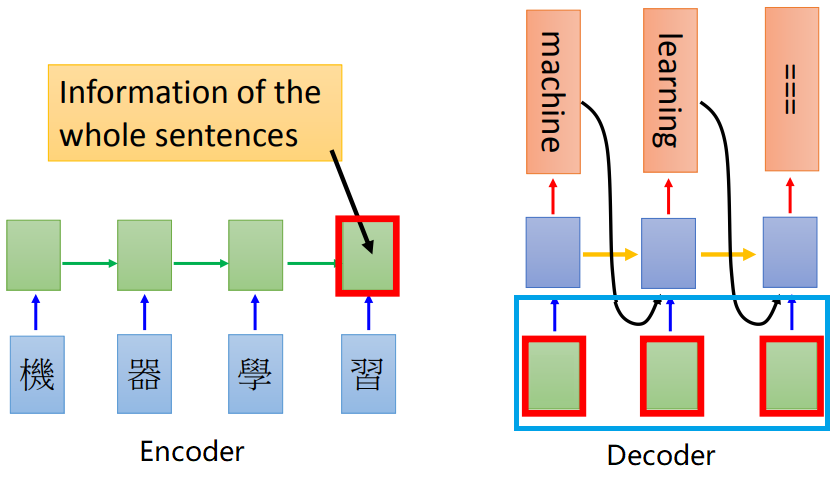
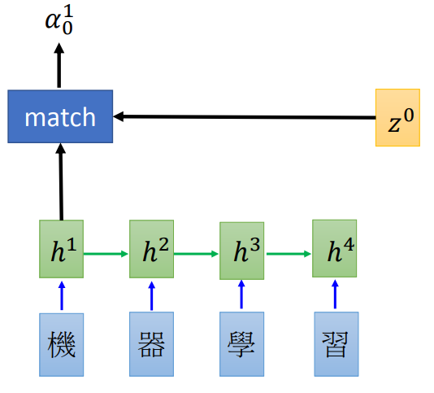
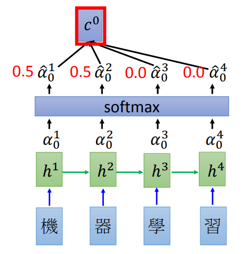
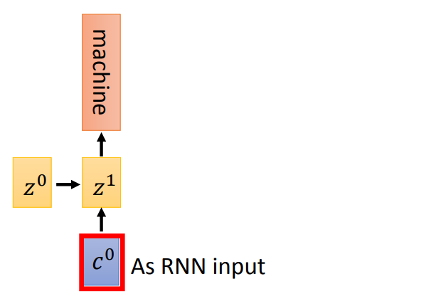
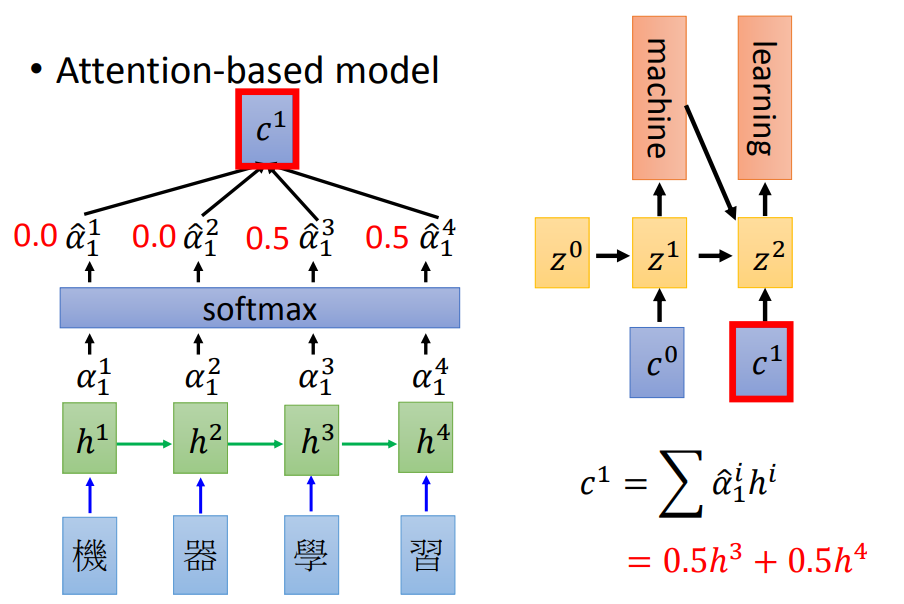
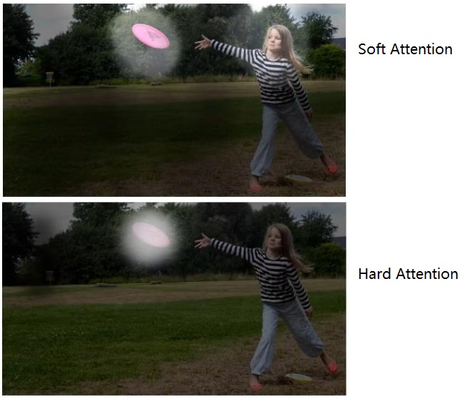
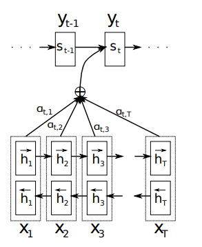
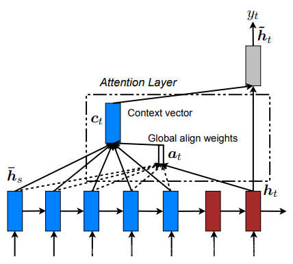
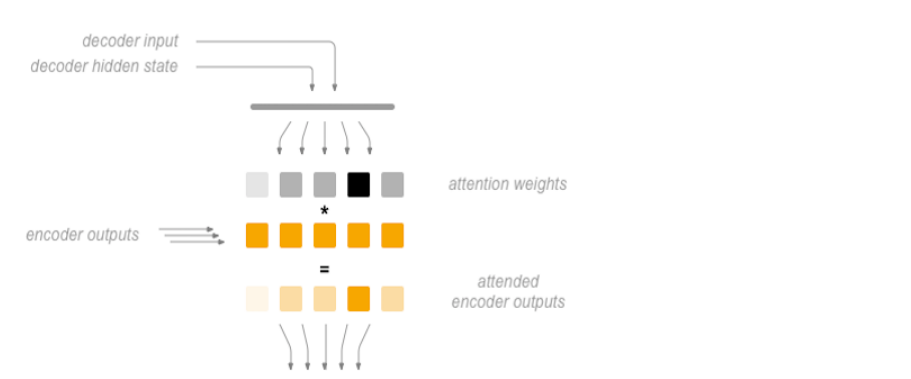

# Attention的原理和实现

## 目标

1. 知道Attention的作用
2. 知道Attention的实现机制
3. 能够使用代码完成Attention代码的编写


## 1. Attention的介绍

在普通的RNN结构中，Encoder需要把一个句子转化为一个向量，然后在Decoder中使用，这就要求Encoder把源句子中所有的信息都包含进去，但是当句子长度过长的时候，这个要求就很难达到，或者说会产生瓶颈（比如，输入一篇文章等场长内容），当然我们可以使用更深的RNN和大多的单元来解决这个问题，但是这样的代价也很大。那么有没有什么方法能够优化现有的RNN结构呢？

为此，Bahdanau等人在2015年提出了`Attenion`机制，`Attention`翻译成为中文叫做注意力，把这种模型称为`Attention based model`。就像我们自己看到一副画，我们能够很快的说出画的主要内容，而忽略画中的背景，因为我们注意的，更关注的往往是其中的主要内容。

通过这种方式，在我们的RNN中，我们有通过LSTM或者是GRU得到的所有信息，那么这些信息中只去关注重点，而不需要在Decoder的每个time step使用全部的encoder的信息，这样就可以解决第一段所说的问题了

那么现在要讲的`Attention机制`就能够帮助我们解决这个问题


## 2. Attenion的实现机制

假设我们现在有一个文本翻译的需求，即`机器学习`翻译为`machine learning`。那么这个过程通过前面所学习的Seq2Seq就可以实现



上图的左边是Encoder，能够得到`hidden_state`在右边使用

Deocder中**蓝色方框**中的内容，是为了提高模型的训练速度而使用teacher forcing手段，否则的话会把前一次的输出作为下一次的输入（**但是在Attention模型中不再是这样了**）

那么整个过程中如果使用Attention应该怎么做呢？

在之前我们把encoder的最后一个输出，作为decoder的初始的隐藏状态，现在我们不再这样做

### 2.1 Attention的实现过程

1. 初始化一个Decoder的隐藏状态$z_0​$

2. 这个$z_o$会和encoder第一个time step的output进行match操作（或者是socre操作），得到$\alpha_0^1​$ ，这里的match可以使很多中操作，比如：

   - z和h的余弦值
   - 是一个神经网络，输入为z和h
   - 或者$\alpha = h^T W z​$等
   - 

3. encoder中的每个output都和$z_0​$进行计算之后，得到的结果进行softmax，让他们的和为1(可以理解为权重)

4. 之后把所有的softmax之后的结果和原来encoder的输出$h_i​$进行相加求和得到$c^0​$
   $$
   即： c^0 = \sum\hat{\alpha}_0^ih^i
   $$

   - 

5. 得到$c^0​$之后，把它作为decoder的input，同和传入初始化的$z^0​$，得到第一个time step的输出和hidden_state（$Z^1​$）

   - 

6. 把$Z_1​$再和所有的encoder的output进行match操作，得到的结果进行softmax之后作为权重和encoder的每个timestep的结果相乘求和得到$c^1​$

7. 再把$c^1​$作为decoder的input，和$Z^1​$作为输入得到下一个输出，如此循环,只到最终decoder的output为终止符

   - 

8. 上述参考：http://speech.ee.ntu.edu.tw/~tlkagk/courses_MLSD15_2.html

9. 整个过程写成数学公式如下： 
   $$
   \begin{align*}
   \alpha_{ij} &= \frac{exp(score(h_i,\overline{h}_j))}{\sum exp(score(h_n,\overline{h}_m))} & [attention \quad weight]\\
   c_i &=\sum \alpha_{ij}\overline{h}_s  & [context\quad vector] \\
   \alpha_i &= f(c_i,h_i) = tanh(W_c[c_i;h_i]) &[attenton \quad result]
   \end{align*}
   $$

   1. 先计算attention权重
   2. 在计算上下文向量，图中的$c^i​$
   3. 最后计算结果，往往会把当前的output([batch_size,1,hidden_size])和上下文向量进行拼接然后使用

### 2.2 不同Attention的介绍

在上述过程中，使用decoder的状态和encoder的状态的计算后的结果作为权重，乘上encoder每个时间步的输出，这需要我们去训练一个合适的match函数，得到的结果就能够在不同的时间步上使用不同的encoder的相关信息，从而达到只关注某一个局部的效果，也就是注意力的效果

### 2.2.1 `Soft-Attention 和 Hard-Attention`

最开始`Bahdanau`等人提出的Attention机制通常被称为`soft-attention`,所谓的`soft-attention`指的是encoder中输入的每个词语都会计算得到一个注意力的概率。

在进行图像捕捉的时候，提出了一种`hard-attenion`的方法，希望直接从input中找到一个和输出的某个词对应的那一个词。但是由于NLP中词语和词语之间往往存在联系，不会只关注某一个词语，所以都会使用soft-attention，所以这里的就不多介绍hard-attention



### 2.2.3 `Global-Attention 和Local Attention`

`Bahdanau`等人提出的`Bahdanau Attention` 被称为`local attention`,后来`Luong`等人提出的`Luong Attention`是一种全局的attenion。

所谓全局的attenion指的是：使用的全部的encoder端的输入的attenion的权重

`local-attenion`就是使用了部分的encoder端的输入的权重(当前时间步上的encoder的hidden state)，这样可以减少计算量，特别是当句子的长度比较长的时候。


### 2.2.4  `Bahdanau Attention和 Luong Attenion`的区别

区别在于两个地方：

1. attention的计算数据和位置

   1. `Bahdanau Attention`会使用`前一次的隐藏`状态来计算attention weight，所以我们会在代码中的GRU之前使用attention的操作，同时会把attention的结果和word embedding的结果进行concat，作为GRU的输出(参考的是pytorch Toritul)。Bahdanau使用的是双向的GRU，会使用正反的encoder的output的concat的结果作为encoder output,如下图所示
      - 
   2. `Luong Attenion`使用的是`当前一次的decoder的output`来计算得到attention weight，所以在代码中会在GRU的后面进行attention的操作，同时会把`context vector`和gru的结果进行concat的操作，最终的output。Luong使用的是多层GRU，只会使用最后一层的输出(encoder output)
      - 

2. 计算attention weights的方法不同

   1. `Bahdanau Attention`的match函数，$a_i^j = v^T_a tanh (W_aZ_{i-1},+U_ah_j)$，计算出所有的$a_i^j$之后，在计算softmax，得到$\hat{a}_i^j$，即$\hat{a}_i^j = \frac{exp(a_i^j)}{\sum exp(a_i^j)}$

      其中
      1. $v_a^T是一个参数矩阵，需要被训练，W_a是实现对Z_{i-1}的形状变化​$，
      2. $U_a实现对h_j的形状变化（矩阵乘法，理解为线性回归，实现数据形状的对齐）​$，
      3. $Z_{i-1}是decoder端前一次的隐藏状态，h_j是encoder的output​$

   2. `Luong Attenion`整体比`Bahdanau Attention`更加简单，他使用了三种方法来计算得到权重

      1. 矩阵乘法：general
         - 直接对decoder的隐藏状态进行一个矩阵变换（线性回归），然后和encoder outputs进行矩阵乘法
      2. dot
         - 直接对decoder的隐藏状态和encoder outputs进行矩阵乘法
      3. concat
         - 把前一次的隐藏状态和encoder的output进行concat，把这个结果使用tanh进行处理后的结果进行对齐计算之后，和encoder outputs进行矩阵乘法
      4. 
         - $h_t\text{是当前的decoder hidden state,}h_s\text{是所有的encoder 的hidden state(encoder output)}$


最终两个attention的结果区别并不太大，所以以后我们可以考虑使用Luong attention完成代码

## 3. Attention的代码实现

完成代码之前，我们需要确定我们的思路，通过attention的代码，需要实现计算的是attention weight

通过前面的学习，我们知道`attention_weight = f(hidden,encoder_outputs)`，主要就是实现Luong attention中的三种操作



```python
class Attention(nn.Module):
    def __init__(self,method,batch_size,hidden_size):
        super(Attention,self).__init__()
        self.method = method
        self.hidden_size = hidden_size

        assert self.method in ["dot","general","concat"],"method 只能是 dot,general,concat,当前是{}".format(self.method)

        if self.method == "dot":
            pass
        elif self.method == "general":
            self.Wa = nn.Linear(hidden_size,hidden_size,bias=False)
        elif self.method == "concat":
            self.Wa = nn.Linear(hidden_size*2,hidden_size,bias=False)
            self.Va = nn.Parameter(torch.FloatTensor(batch_size,hidden_size))

    def forward(self, hidden,encoder_outputs):
        """
        :param hidden:[1,batch_size,hidden_size]
        :param encoder_outputs: [batch_size,seq_len,hidden_size]
        :return:
        """
        batch_size,seq_len,hidden_size = encoder_outputs.size()

        hidden = hidden.squeeze(0) #[batch_size,hidden_size]

        if self.method == "dot":
            return self.dot_score(hidden,encoder_outputs)
        elif self.method == "general":
            return self.general_score(hidden,encoder_outputs)
        elif self.method == "concat":
            return self.concat_score(hidden,encoder_outputs)

    def _score(self,batch_size,seq_len,hidden,encoder_outputs):
        # 速度太慢
        # [batch_size,seql_len]
        attn_energies = torch.zeros(batch_size,seq_len).to(config.device)
        for b in range(batch_size):
            for i in range(seq_len):
                #torch.Size([256, 128]) torch.Size([128]) torch.Size([256, 24, 128]) torch.Size([128])
                # print("attn size:",hidden.size(),hidden[b,:].size(),encoder_output.size(),encoder_output[b,i].size())
                attn_energies[b,i] = hidden[b,:].dot(encoder_outputs[b,i]) #dot score
        return F.softmax(attn_energies).unsqueeze(1)  # [batch_size,1,seq_len]

    def dot_score(self,hidden,encoder_outputs):
        """
        dot attention
        :param hidden:[batch_size,hidden_size]
        :param encoder_outputs: [batch_size,seq_len,hidden_size]
        :return:
        """
        hidden = hidden.unsqueeze(-1)
        attn_energies = torch.bmm(encoder_outputs, hidden)
        attn_energies = attn_energies.squeeze(-1) #[batch_size,seq_len,1] ==>[batch_size,seq_len]

        return F.softmax(attn_energies).unsqueeze(1)  # [batch_size,1,seq_len]

    def general_score(self,hidden,encoder_outputs):
        """
        general attenion
        :param batch_size:int
        :param hidden: [batch_size,hidden_size]
        :param encoder_outputs: [batch_size,seq_len,hidden_size]
        :return:
        """
        x = self.Wa(hidden) #[batch_size,hidden_size]
        x = x.unsqueeze(-1) #[batch_size,hidden_size,1]
        attn_energies = torch.bmm(encoder_outputs,x).squeeze(-1) #[batch_size,seq_len,1]
        return F.softmax(attn_energies,dim=-1).unsqueeze(1)      # [batch_size,1,seq_len]

    def concat_score(self,hidden,encoder_outputs):
        """
        concat attention
        :param batch_size:int
        :param hidden: [batch_size,hidden_size]
        :param encoder_outputs: [batch_size,seq_len,hidden_size]
        :return:
        """
        #需要先进行repeat操作，变成和encoder_outputs相同的形状,让每个batch有seq_len个hidden_size
        x = hidden.repeat(1,encoder_outputs.size(1),1) ##[batch_size,seq_len,hidden_size]
        x = torch.tanh(self.Wa(torch.cat([x,encoder_outputs],dim=-1))) #[batch_size,seq_len,hidden_size*2] --> [batch_size,seq_len,hidden_size]
        #va [batch_size,hidden_size] ---> [batch_size,hidden_size,1]
        attn_energis = torch.bmm(x,self.Va.unsqueeze(2))  #[batch_size,seq_len,1]
        attn_energis = attn_energis.squeeze(-1)
        # print("concat attention:",attn_energis.size(),encoder_outputs.size())
        return F.softmax(attn_energis,dim=-1).unsqueeze(1) #[batch_size,1,seq_len]
```


完成了`attention weight`的计算之后，需要再对代码中`forward_step`的内容进行修改

```python
 def forward_step(self,decoder_input,decoder_hidden,encoder_outputs):
        """
        :param decoder_input:[batch_size,1]
        :param decoder_hidden: [1,batch_size,hidden_size]
        :param encoder_outputs: encoder中所有的输出，[batch_size,seq_len,hidden_size]
        :return: out:[batch_size,vocab_size],decoder_hidden:[1,batch_size,didden_size]
        """
        embeded = self.embedding(decoder_input)  #embeded: [batch_size,1 , embedding_dim]
        
        #TODO 可以把embeded的结果和前一次的context（初始值为全0tensor） concate之后作为结果
        #rnn_input = torch.cat((embeded, last_context.unsqueeze(0)), 2)
        
        # gru_out:[256,1, 128]  decoder_hidden: [1, batch_size, hidden_size]
        gru_out,decoder_hidden = self.gru(embeded,decoder_hidden)
        gru_out = gru_out.squeeze(1)
        
        #TODO 注意：如果是单层，这里使用decoder_hidden没问题（output和hidden相同）
        # 如果是多层，可以使用GRU的output作为attention的输入
        #开始使用attention
        attn_weights = self.attn(decoder_hidden,encoder_outputs)
        # attn_weights [batch_size,1,seq_len] * [batch_size,seq_len,hidden_size]
        context = attn_weights.bmm(encoder_outputs) #[batch_size,1,hidden_size]

        gru_out = gru_out.squeeze(0)  # [batch_size,hidden_size]
        context = context.squeeze(1)  # [batch_size,hidden_size]
        #把output和attention的结果合并到一起
        concat_input = torch.cat((gru_out, context), 1) #[batch_size,hidden_size*2]
        
        concat_output = torch.tanh(self.concat(concat_input)) #[batch_size,hidden_size]

        output = F.log_softmax(self.fc(concat_output),dim=-1) #[batch_Size, vocab_size]
        # out = out.squeeze(1)
        return output,decoder_hidden,attn_weights
```


attetnion的Bahdanau实现可以参考：https://github.com/spro/practical-pytorch/blob/master/seq2seq-translation/seq2seq-translation.ipynb