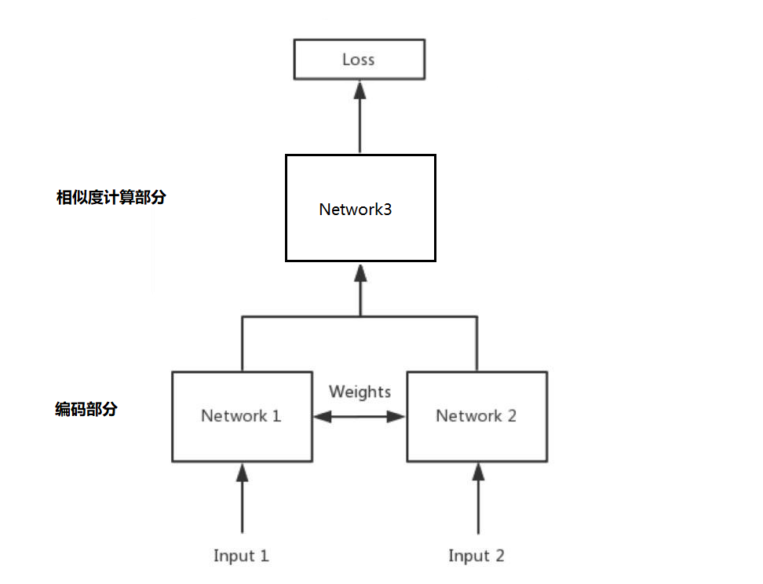
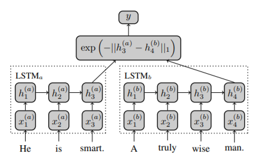
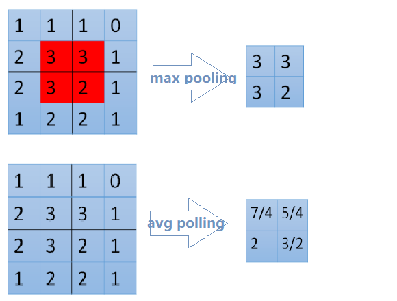
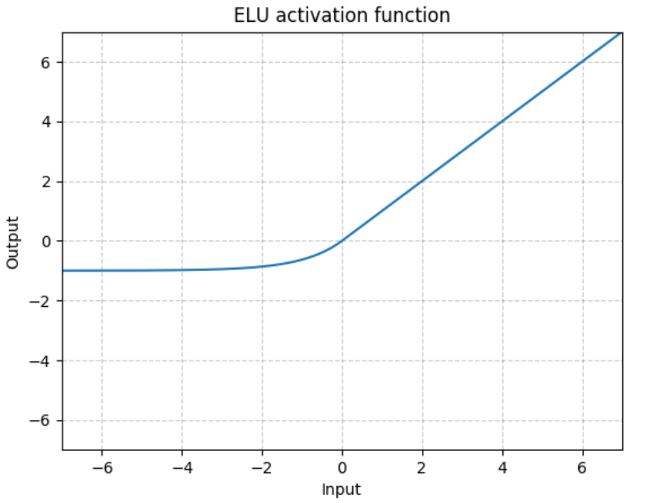
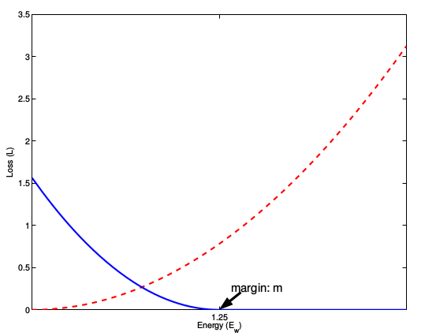

# 问答机器人排序模型

## 目标

1. 知道模型中排序中的概念和目的
2. 知道模型中排序的实现方法


## 1. 排序模型的介绍

前面的课程中为了完成一个问答机器人，我们先进行了召回，相当于是通过海选的方法找到呢大致相似的问题。

通过现在的排序模型，我们需要精选出最相似的哪一个问题，返回对应的答案


## 2. 排序模型的实现思路

我们需要实现的排序模型是两个输入，即两个问题，输出的是一个相似度。所以和之前的深度学习模型一样，我们需要实现的步骤如下：

1. 准备数据
2. 构建模型
3. 模型评估
4. 对外提供接口返回结果

### 2.1 准备数据

这里的数据，我们使用之前采集的百度问答的相似问题和手动构造的数据。那么，我们需要把他格式化为最终模型需要的格式，即两个输入和输出的相似度。

#### 2.1.1 两个输入

这里的输入，我们可以使用单个字作为特征，也可以使用一个分词之后的词语作为特征。所以在实现准备输入数据方法的过程中，可以提前准备。

#### 2.1.2 相似度准备

这里我们使用每个问题搜索结果的前两页认为他们是相似的，相似度为1，最后两页的结果是不相似的，相似度为0。


### 2.2 构建模型

介绍模型的构建之前，我们先介绍下孪生神经网络(Siamese Network)和其名字的由来。

Siamese和Chinese有点像。Siamese是古时候泰国的称呼，中文译作暹罗。Siamese在英语中是“孪生”、“连体”的意思。为什么孪生和泰国有关系呢？

> 十九世纪泰国出生了一对连体婴儿，当时的医学技术无法使两人分离出来，于是两人顽强地生活了一生，1829年被英国商人发现，进入马戏团，在全世界各地表演，1839年他们访问美国北卡罗莱那州后来成为马戏团的台柱，最后成为美国公民。1843年4月13日跟英国一对姐妹结婚，恩生了10个小孩，昌生了12个，姐妹吵架时，兄弟就要轮流到每个老婆家住三天。1874年恩因肺病去世，另一位不久也去世，两人均于63岁离开人间。两人的肝至今仍保存在费城的马特博物馆内。从此之后“暹罗双胞胎”（Siamese twins）就成了连体人的代名词，也因为这对双胞胎让全世界都重视到这项特殊疾病。

所以孪生神经网络就是有两个共享权值的网络的组成，或者只用实现一个，另一个直接调用，有两个输入，一个输出。1993年就已经被用来进行支票签名的验证。

孪生神经网络通过两个输入，被DNN进行编码，得到向量的表示之后，根据实际的用途来制定损失函数。比如我们需要计算相似度的时候，可以使用余弦相似度，或者使用$exp^{-||h^{left}-h^{right}||}$来确定向量的距离。

孪生神经网络被用于有多个输入和一个输出的场景，比如手写字体识别、文本相似度检验、人脸识别等

在计算相似度之前，我们可以考虑在传统的孪生神经网络的基础上，在计算相似度之前，把我们的编码之后的向量通过多层神经网络进行非线性的变化，结果往往会更加好，那么此时其网络结构大致如下：



其中Network1和network2为权重参数共享的两个形状相同的网络，用来对输入的数据进行编码，包括（`word-embedding,GRU,biGRU等`），Network3部分是一个深层的神经网络，包含（`batchnorm、dropout、relu、Linear`等层）

### 2.3 模型的评估

编写预测和评估的代码，预测的过程只需要修改获得结果，不需要上图中的损失计算的剁成

## 3. 代码实现

### 3.1 数据准备

##### 3.1.1 对文本进行分词分开存储

这里的分词可以对之前的分词方法进行修改

```python
def cut_sentence_by_word(sentence):
    # 对中文按照字进行处理，对英文不分为字母
    letters = string.ascii_lowercase + "+" + "/"  # c++,ui/ue
    result = []
    temp = ""
    for word in line:
        if word.lower() in letters:
            temp += word.lower()
        else:
            if temp != "":
                result.append(temp)
                temp = ""
            result.append(word)
    if temp != "":
        result.append(temp)
    return result

def jieba_cut(sentence,by_word=False,with_sg=False,use_stopwords=False):
    if by_word:
        return cut_sentence_by_word(sentence)
    ret = psg.lcut(sentence)
    if use_stopwords:
        ret = [(i.word, i.flag) for i in ret if i.word not in stopwords_list]
    if not with_sg:
        ret = [i[0] for i in ret]
    return ret
```

##### 3.1.2 准备`word Sequence`代码

该处的代码和seq2seq中的代码相同，直接使用

##### 3.1.3 准备`Dataset`和`DataLoader`

和seq2seq中的代码大致相同

### 3.2 模型的搭建

前面做好了准备工作之后，就需要开始进行模型的搭建。

虽然我们知道了整个结构的大致情况，但是我们还是不知道其中具体的细节。

2016年`AAAI`会议上，有一篇`Siamese Recurrent Architectures for Learning Sentence Similarity`的论文（地址：https://www.aaai.org/ocs/index.php/AAAI/AAAI16/paper/download/12195/12023）。整个结构如下图：




可以看到word 经过embedding之后进行LSTM的处理，然后经过exp来确定相似度，可以看到整个模型是非常简单的，之后很多人在这个结构上增加了更多的层，比如加入attention、dropout、pooling等层。

那么这个时候，请思考下面几个问题：

1. attention在这个网络结构中该如何实现

   - 之前我们的attention是用在decoder中，让decoder的hidden和encoder的output进行运算，得到attention的weight，再和decoder的output进行计算，作为下一次decoder的输入

   - 那么在当前我们可以把`句子A的output理解为句子B的encoder的output`，那么我们就可以进行attention的计算了

     > 和这个非常相似的有一个attention的变种，叫做`self attention`。前面所讲的Attention是基于source端和target端的隐变量（hidden state）计算Attention的，得到的结果是源端的每个词与目标端每个词之间的依赖关系。`Self Attention`不同，它分别在source端和target端进行，仅与source input或者target input自身相关的Self Attention，捕捉source端或target端自身的词与词之间的依赖关系。

2. dropout用在什么地方

   - dropout可以用在很多地方，比如embedding之后
   - BiGRU结构中
   - 或者是相似度计算之前

3. pooling是什么如何使用

   - pooling叫做池化，是一种降采样的技术，用来减少特征(feature)的数量。常用的方法有`max pooling` 或者是`average pooling`


#### 3.2.1 编码部分

```python
    def forward(self, *input):
        
        sent1, sent2 = input[0], input[1]
        #这里使用mask，在后面计算attention的时候，让其忽略pad的位置
        mask1, mask2 = sent1.eq(0), sent2.eq(0)

        # embeds: batch_size * seq_len => batch_size * seq_len * batch_size
        x1 = self.embeds(sent1)
        x2 = self.embeds(sent2)

        # batch_size * seq_len * dim => batch_size * seq_len * hidden_size
        output1, _ = self.lstm1(x1)
        output2, _ = self.lstm1(x2)

        # 进行Attention的操作，同时进行形状的对齐
        # batch_size * seq_len * hidden_size
        q1_align, q2_align = self.soft_attention_align(output1, output2, mask1, mask2)

        # 拼接之后再传入LSTM中进行处理
        # batch_size * seq_len * (8 * hidden_size)
        q1_combined = torch.cat([output1, q1_align, self.submul(output1, q1_align)], -1)
        q2_combined = torch.cat([output2, q2_align, self.submul(output2, q2_align)], -1)

        # batch_size * seq_len * (2 * hidden_size)
        q1_compose, _ = self.lstm2(q1_combined)
        q2_compose, _ = self.lstm2(q2_combined)

        # 进行Aggregate操作，也就是进行pooling
        # input: batch_size * seq_len * (2 * hidden_size)
        # output: batch_size * (4 * hidden_size)
        q1_rep = self.apply_pooling(q1_compose)
        q2_rep = self.apply_pooling(q2_compose)

		# Concate合并到一起，用来进行计算相似度
        x = torch.cat([q1_rep, q2_rep], -1)
```

##### atttention的计算

实现思路：

1. 先获取attention_weight
2. 在使用attention_weight和encoder_output进行相乘

```python
    def soft_attention_align(self, x1, x2, mask1, mask2):
        '''
        x1: batch_size * seq_len_1 * hidden_size
        x2: batch_size * seq_len_2 * hidden_size
        '''
        # attention: batch_size * seq_len_1 * seq_len_2
        attention_weight = torch.matmul(x1, x2.transpose(1, 2))
        #mask1 : batch_size,seq_len1
        mask1 = mask1.float().masked_fill_(mask1, float('-inf'))
        #mask2 : batch_size,seq_len2
        mask2 = mask2.float().masked_fill_(mask2, float('-inf'))

        # weight: batch_size * seq_len_1 * seq_len_2
        weight1 = F.softmax(attention_weight + mask2.unsqueeze(1), dim=-1)
        #batch_size*seq_len_1*hidden_size
        x1_align = torch.matmul(weight1, x2)
        
        #同理，需要对attention_weight进行permute操作
        weight2 = F.softmax(attention_weight.transpose(1, 2) + mask1.unsqueeze(1), dim=-1)
        x2_align = torch.matmul(weight2, x1)
```

##### Pooling实现

池化的过程有一个`窗口`的概念在其中，所以max 或者是average指的是窗口中的值取最大值还是取平均估值。整个过程可以理解为拿着窗口在源数据上取值

窗口有窗口大小(kernel_size，窗口多大)和步长(stride，每次移动多少)两个概念

- ```python
  >>> input = torch.tensor([[[1,2,3,4,5,6,7]]])
  >>> F.avg_pool1d(input, kernel_size=3, stride=2)
  tensor([[[ 2.,  4.,  6.]]]) #[1,2,3] [3,4,5] [5,6,7]的平均估值
  ```



```python
def apply_pooling(self, x):
    # input: batch_size * seq_len * (2 * hidden_size)
    #进行平均池化
    p1 = F.avg_pool1d(x.transpose(1, 2), x.size(1)).squeeze(-1)
    #进行最大池化
    p2 = F.max_pool1d(x.transpose(1, 2), x.size(1)).squeeze(-1)
    # output: batch_size * (4 * hidden_size)
    return torch.cat([p1, p2], 1)
```

##### 3.2.2 相似度计算部分

相似度的计算我们可以使用一个传统的距离计算公式，或者是exp的方法来实现，但是其效果不一定好，所以这里我们使用一个深层的神经网络来实现，使用pytorch中的Sequential对象来实现非常简单

```python
self.fc = nn.Sequential(
    nn.BatchNorm1d(self.hidden_size * 8),
    nn.Linear(self.hidden_size * 8, self.linear_size),
    nn.ELU(inplace=True),
    nn.BatchNorm1d(self.linear_size),
    nn.Dropout(self.dropout),
    
    nn.Linear(self.linear_size, self.linear_size),
    nn.ELU(inplace=True),
    nn.BatchNorm1d(self.linear_size),
    nn.Dropout(self.dropout),
    
    nn.Linear(self.linear_size, 2),
    nn.Softmax(dim=-1)
)
```

在上述过程中，我们使用了激活函数ELU，而没有使用RELU，因为在有噪声的数据中ELU的效果往往会更好。

$ELU(*x*)=max(0,x)+min(0,α∗(exp(x)−1))$,其中$\alpha​$在torch中默认值为1。

通过下图可以看出他和RELU的区别，RELU在小于0的位置全部为0,但是ELU在小于零的位置是从0到-1的。可以理解为正常的数据汇总难免出现噪声，小于0的值，而RELU会直接把他处理为0，认为其实正常值，但是ELU却会保留他，所以ELU比RELU更有鲁棒性




##### 3.2.3 损失函数部分

在孪生神经网络中我们经常会使用对比损失（Contrastive Loss），作为损失函数，对比损失是`Yann LeCun`提出的用来判断数据降维之后和源数据是否相似的问题。在这里我们用它来判断两个句子的表示是否相似。

对比损失的计算公式如下：
$$
L = \frac{1}{2N}\sum^N_{n=1}(yd^2 + (1-y)max(margin-d,0)^2)
$$
其中$d = ||a_n-b_n||_2$,代表两个两本特征的欧氏距离，y表示是否匹配，y=1表示匹配，y=0表示不匹配，margin是一个阈值，比如margin=1。

上式可分为两个部分，即：

1. y = 1时，只剩下左边，$\sum yd^2$，即相似的样本，如果距离太大，则效果不好，损失变大
2. y=0的时候，只剩下右边部分，即样本不相似的时候，如果距离小的话，效果反而不好，损失变大

下图红色是相似样本的损失，蓝色是不相似样本的损失



但是前面我们已经计算出了相似度，所以在这里我们有两个操作

1. 使用前面的相似度的结果，把整个问题转化为分类（相似，不相似）的问题，或者是转化为回归问题（相似度是多少）
2. 不是用前面相似度的计算结果部分，只用编码之后的结果，然后使用对比损失。最后在获取距离的时候使用欧氏距离来计算器相似度

##### 使用DNN+均方误差来计算得到结果

```python
def train(model,optimizer,loss_func,epoch):
    model.tarin()
        for batch_idx, (q,simq,q_len,simq_len,sim) in enumerate(train_loader):
            optimizer.zero_grad()
        	output = model(q.to(config.device),simq.to(config.device))
            loss = loss_func(output,sim.to(config.deivce))
            loss.backward()
            optimizer.step()
            if batch_idx%100==0:
            	print("...")
            	torch.save(model.state_dict(), './DNN/data/model_paramters.pkl')
                torch.save(optimizer.state_dict(),"./DNN/data/optimizer_paramters.pkl")

            
model = SiameseNetwork().cuda()
loss =  torch.nn.MSELoss()
optimizer = optim.Adam(model.parameters(), lr=0.001)
for epoch in range(1,config.epoch+1):
    train(model,optimizer,loss,epoch)
```

#### 使用对比损失来计算得到结果

```python
#contrastive_loss.py
import torch
import torch.nn
class ContrastiveLoss(torch.nn.Module):
    """
    Contrastive loss function.
    """

    def __init__(self, margin=1.0):
        super(ContrastiveLoss, self).__init__()
        self.margin = margin

    def forward(self, x0, x1, y):
        # 欧式距离
        diff = x0 - x1
        dist_sq = torch.sum(torch.pow(diff, 2), 1)
        dist = torch.sqrt(dist_sq)

        mdist = self.margin - dist
        #clamp(input,min,max),和numpy中裁剪的效果相同
        dist = torch.clamp(mdist, min=0.0)
        loss = y * dist_sq + (1 - y) * torch.pow(dist, 2)
        loss = torch.sum(loss) / 2.0 / x0.size()[0]
        return loss
```

之后只需要把原来的损失函数改为当前的损失函数即可


### 3.3 不同模型的结果对比