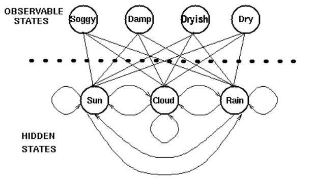
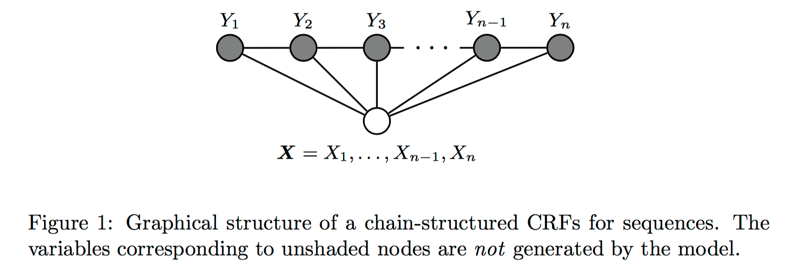

# 隐马尔可夫

## 目标

1. 知道什么是自动机
2. 知道什么是马尔可夫链
3. 知道隐马尔可夫是什么
4. 知道隐马尔可夫的原理是什么
5. 知道如何使用隐马尔可夫完成分词，词性标注等任务
6. 知道MEMM是什么
7. 知道CRF是什么


## 1. 自动机

自动机：（又称为 有限自动机，有限状态自动机，FSA）是表示有限个状态以及在这些状态之间的转移和动作等行为的数学模型。

例如：

我们常用的正则表达式就是一种用来描述字符串出现字符的自动机。

假如我们有正则表达式：`baa+!`，表示的是ba后面有1个或这多个a，最后是一个感叹号。

我们可以把上述的自动机用图来展示，如下：


自动机从初始状态q0开始，反复进行下面的过程：找到第一个字母b，如果找到b那么进入到下一个状态，再去寻找下一个状态需要的字母，指导进行接收状态q4。

我们可以使用状态转移表来自动机：


上述的状态机我们也称为**确定的自动状态机DFSA**(例如红绿灯)，如果位于q3的循环在q2上，那么在q2状态下，看到a，他是不清楚要向那个地方进行转移的。所以把这种状态机成为**非确定的自动状态机 NFSA**，（比如天气）。

## 马尔可夫链和马尔可夫假设

马尔可链是自动状态机的扩展版，是一种带权的自动状态机。权重在马尔可夫链中就是连接弧的概率。离开一个节点的所有的概率和为1。

用马尔可夫链描述天气的变化，如果使用图模型来描述的话，可以有下面的示例：


如果今天下雨，那么明天的天气会怎么样呢？

明天下雪的概率：0.02

明天下雨的概率：0.8

明天晴天的概率：0.18

上述的过程包含了概率上的一个重要那就：在一个**一阶马尔可夫链**中，一个特定状态的概率只和他的前一个状态是有关的：

**马尔可夫假设**：
$$
P(q_i|q_{i-1}\cdots q_1) = P(q_i|q_{i-1})
$$
如果是把马尔可夫应用于NLP的文本序列，那么他表示的就是**二元N-gram模型**


## 隐马尔可夫模型

当我们要计算我们能够观察到的事件序列的概率的时候，马尔可夫链是很有用的。但是在很多情况下，我们感兴趣的概率是没有办法直接计算的。例如在**词性标注**的问题中，我们能够看到句子中的词，能够计算这个句子组合的概率。但是我们的目标是或者这个句子对应的词性的序列。这些词性序列是隐藏的，不能够直接被观察到，我们需要去推断隐藏的状态，这个时候我们就需要使用**隐马尔科夫模型（HMM）**。

隐马尔可夫模型可以使用以下内容来进行描述：

> $Q = q_1,q_2,\cdots q_N$  状态N的集合
>
> $A = a_{11},a_{12}，\cdots,a_{nn}$  转移概率矩阵A。每一个转移概率$a_{ij}$表示从状态i转移到状态j的概率，同时从某一个状态出发的转移概率和为1
>
> $O = O_1,O_2 \cdots O_n​$ 观察到的序列T
>
> $B = b_i(O_i)​$  观察似然度，也叫做发射概率，表示从状态i得到观察$O_i​$的概率
>
> q_0,q_F  表示初始状态和终结状态


隐马尔可夫模型中，除了马尔可夫假设之外，还有另外一个假设，即输出独立性假设，即:

一个输出观察$O_i$的概率只和产生该观察的状态$q_i$有关
$$
P(O_i|q_1,q_2\cdots q_T ，O_1,O_2 \cdots O_T) = P(O_i|q_i)
$$


在类似词性标注的问题中，我们需要做的事情，在含有n个单词的观察序列的所有可能的隐藏序列中找到一个概率最大的隐藏序列，写成公式如下(其中帽子符号$\hat{}$表示对正确序列的估计)：
$$
\hat{t}_n = \mathop{argmax}_{t_n}P(t_n|w_n) 
$$


根据前面的两个概率假设，上述公式也可以写为：
$$
\hat{t}_n = \mathop{argmax}_{t_n}P(t_n|w_n) = \mathop{argmax}_{t_n}P(w_i|t_i)P(t_i|t_{i-1})
$$
上述的公式中包含两个概率：

1. 标记的 **转移概率**：$P(t_i|t_{i-1})$

2. 单词的**似然度(likelihood)**:又称为发射概率，即在状态$t_i$的情况下发现观测值为$w_i$的概率。

   > 似然度：likelihood的中文翻译，表示可能性、概率的意思

转移概率的计算方法：通过极大似然估计(MLE)，通过现有的语料，直接计算即可：

即：状态从$t_{i-1}到t_i$的总数 除以$t_{i-1}$的总数
$$
P(t_i|t_{i-1}) = \frac{C(t_{i-1},t_i)}{C(t_{i-1})}
$$

> **极大似然估计**：是一种概率在统计学中的应用，是一种参数估计方法，说的是说的是已知某个随机样本满足某种概率分布，但是其中具体的参数不清楚，参数估计就是通过若干次试验，使用实验得出的概率作为样本的概率。

似然度概率的计算方法同理：
$$
P(w_i|t_i) = \frac{C(t_i,w_i)}{C(t_i)}
$$
即数据集中所有的$w_i为t_i$的样本数量 除以 该状态$t_i$的总数


**例子**:

传说海藻的能够预测天气，假如海藻有下面四种状态，天气有三种状态，那么现在我们知道一列海藻的状态`[Damp,Dryish,Dry,Soggy]`,那么我们想知道对应这四天的天气是什么样子的，需要如何计算？



要完成上述的问题，我们需要历史的数据，假设我们有如下的历史数据：

1. 第一天分别为[sun,cloud,Rain]的概率分别是[0.3,0.3,0.4]

2. 状态转移概率和发射概率如下

   


最简单的方式，我们可以计算满足要求`[Damp,Dryish,Dry,Soggy]`的所有的天气状态的概率，然后进行乘积，得到结果，那么我们需要计算$N^M$次，其中M表示观测值的数量，N表示状态的数量

## 计算隐藏序列的Viterbi算法

Viterbi是一种经典的动态规划算法，能够把上述求解隐藏状态的时间复杂度从$O(N^M)$转化为$O(N^2*M)$

> 动态规划：把多阶段决策过程的最优化问题转化为一系列单阶段的问题

其实现过程如下：

1. 遍历所有的状态，根据初始状态的概率计算*观察序列对应的发射概率，得到第一次概率结果，选择概率最大的隐藏状态作为第一次的状态
2. 遍历从第二次到最后的时间步
3. 遍历所有的状态
4. 计算：前一次的概率结果\*转移概率\*发射概率，选择概率最大的隐藏状态作为当前的隐藏状态

使用viterbi算法实现分词的部分代码实现如下：

```python
    def start_calcute(self,sentence):
        '''
        通过viterbi算法计算结果
        :param sentence: "小明硕士毕业于中国科学院计算所"
        :return: "S...E"
        '''
        zero = -3.14e+100
        zero_log = np.log(-3.14e+100)
        init_state = self.prob_dict["PiVector_prob"]
        trans_prob = self.prob_dict["TransProbMatrix_prob"]
        emit_prob = self.prob_dict["EmitProbMartix_prob"]

        V = [{}]
        path = {}

        #初始概率
        for y in self.state_list:
            V[0][y] = init_state[y] + emit_prob[y].get(sentence[0],zero_log)
            path[y] = [y]
		
        #从第二次到最后一个时间步
        for t in range(1,len(sentence)):
            V.append({})
            newpath = {}
            for y in self.state_list: #遍历所有的当前状态
                    temp_state_prob_list = []
                    for y0 in self.state_list: #遍历所有的前一次状态
                        cur_prob = V[t-1][y0]+trans_prob[y0][y]+emit_prob[y].get(sentence[t],zero_log)
                        temp_state_prob_list.append([cur_prob,y0])
					#取最大值，作为当前时间步的概率
                    prob,state =  sorted(temp_state_prob_list,key=lambda x:x[0],reverse=True)[0]
                    #保存当前时间步，当前状态的概率
                    V[t][y] = prob
                    #保存当前的状态到newpath中
                    newpath[y] = path[state] + [y]
			#让path为新建的newpath
            path = newpath

        #输出的最后一个结果只会是S（表示单个字）或者E（表示结束符）
        (prob, state) = max([(V[len(sentence) - 1][y], y) for y in ["S","E"]])
        return (prob, path[state])
```


## 最大熵马尔科夫模型


最大熵模型（MaxEnt）：指的是多元逻辑回归

由于等概率的分布具有最大熵，所以最大熵的模型通过词性标注问题来描述就是：

1. 在没有任何假设的情况下，认为每种词性的概率都是相同的，假设有10中词性，那么每个词性的概率都是1/10
2. 如果语料表明，所有的词语出现的词性只有10个中的四个，那么此时，调整所有词的词性为$A:1/4 ,B:1/4,C:1.4,D:1/4,E:0....$
3. 当我们继续增加语料，发现A和B的概率很高，10次中有8次，某个词的词性不是A就是B，那么此时调整词性概率为：$A:4/10,B:4/10,C:1/10,D:1/10$
4. 重复上述过程

寻找一个熵最大的模型，就是要使用多元逻辑回归，训练他的权重w，让训练数据能够似然度最大化

> 训练数据能够似然度最大化：训练数据是总体的一个抽样，让训练数据尽可能能够代表总体，从而可以让模型可以有更好的表现力

**最大熵马尔科夫模型（MEMM）**是马尔科夫模型的变化版本。在马尔科夫模型中，我们使用贝叶斯理论来计算最有可能的观测序列，即：
$$
\hat{t}_n = \mathop{argmax}_{t_n}P(t_n|w_n) = \mathop{argmax}_{t_n}P(w_i|t_i)P(t_i|t_{i-1})
$$
但是在MEMM中，他直接去计算了后验概率P(t|w),直接对每个观测值的状态进行分类，在MEMM中，把概率进行了拆解：
$$
\hat{T} = \mathop{argmax}_T P(T|W) = \mathop{argmax}\prod_i P(tag_i|word_i,tag_{i-1})
$$
即:使用前一个状态tag和当前的词word，计算当前tag。

和隐马尔可夫模型不同的是，在上述的公式中，对于计算当前tag的分类过程中，输入不仅可以是$word_i和tag_{i-1}$,还可以包含其他的特征，比如：词语的第一个字母是否为大写，词语的后缀类型，前缀类型的等等。

所以MEMM的表现力会比HMM要更好。


## 条件随机场

**条件随机场(conditional random field,CRF)**是有输入x和输出y组成的一种无向图模型，可以看成是最大熵马尔可夫模型的推广。

下图是我们的常用于词性标注的线性链 条件随机场的图结构。其中x是观测序列，Y是标记序列



下图是HMM，MEMM，CRF的对比


当观测序列为 $x=x_1,x_2...$ 时，状态序列为 $y=y_1,y_2....$的概率可写为:
$$
P(Y=y|x)=\frac{1}{Z(x)}\exp\biggl(\sum_k\lambda_k\sum_it_k(y_{i1},y_i,x,i)+\sum_l\mu_l\sum_is_l(y_i,x,i)\biggr) \\
Z(x)=\sum_y\exp\biggl(\sum_k\lambda_k\sum_it_k(y_{i-1},y_i,x,i)+\sum_l\mu_l\sum_is_l(y_i,x,i)\biggr)
$$
其中$Z(x)$是归一化因子，类似softmax中的分母，计算的是所有可能的y的和

后面的部分由**特征函数**组成：

**转移特征：** $t_k(y_{i-1},y_i,x,i)$ 是定义在边上的特征函数（transition），依赖于当前位置 i 和前一位置 i-1 ；对应的权值为 $\lambda_k$ 。

**状态特征：** $s_l(y_i,x,i)$ 是定义在节点上的特征函数（state），依赖于当前位置 i&nbsp;；对应的权值为 $\mu_l$ 。

一般来说，特征函数的取值为 1 或 0 ，当满足规定好的特征条件时取值为 1 ，否则为 0 。

对于`北\B京\E欢\B迎\E你\E`特征函数可以如下：

```
func1 = if (output = B and feature="北") return 1 else return 0
func2 = if (output = M and feature="北") return 1 else return 0
func3 = if (output = E and feature="北") return 1 else return 0
func4 = if (output = B and feature="京") return 1 else return 0
```

每个特征函数的权值 类似于发射概率，是统计后的概率。


